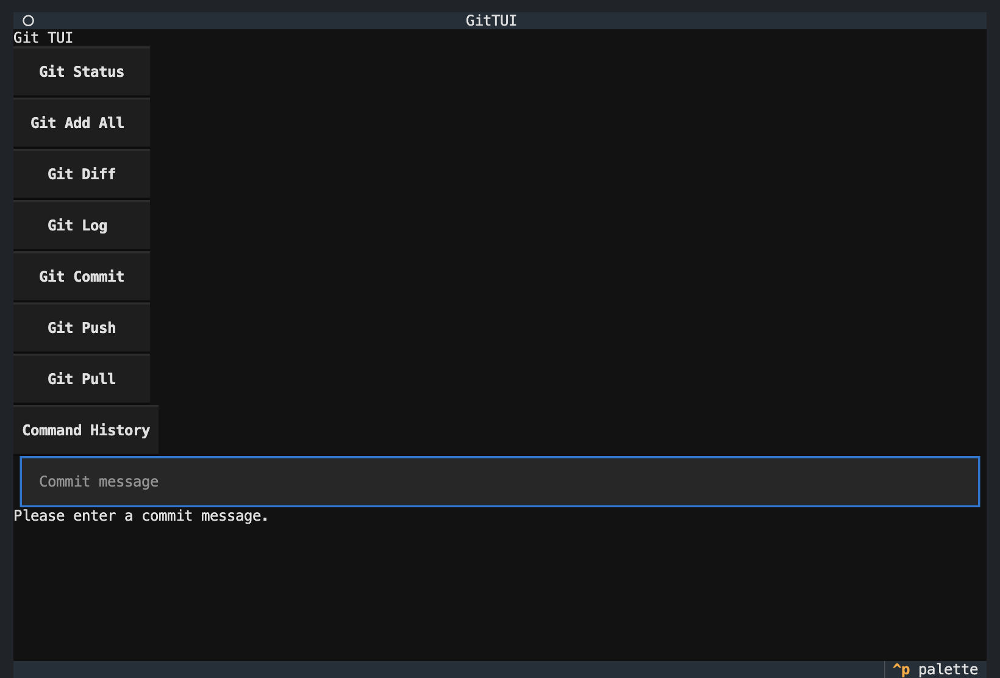

# Git TUI

A simple Terminal User Interface for Git operations.

&copy; 2026

## Org defaults (harpertoken)

This is also the `harpertoken/.github` repository, which powers organization-level defaults:

- Org profile content: `profile/readme.md`
- Org activity bot: `.github/workflows/update-org-activity.yml` updates the activity block in `profile/readme.md`
- Default templates: `.github/ISSUE_TEMPLATE/` and `.github/PULL_REQUEST_TEMPLATE.md`

The activity bot rewrites only the section between:

- `<!-- ORG_ACTIVITY:START -->`
- `<!-- ORG_ACTIVITY:END -->`

## Documentation

See [docs/](docs/) for detailed project state and coverage info.

## Contributing

See [CONTRIBUTING.md](CONTRIBUTING.md) for guidelines.

## Local checks

This repo uses `pre-commit`:

- Install hooks: `pre-commit install`
- Run all checks: `pre-commit run --all-files`

## Conventional commits

This project follows conventional commit standards.

### Setup

To enable commit message validation:

1. Copy the commit hook: `cp scripts/commit-msg .git/hooks/commit-msg`
2. Make it executable: `chmod +x .git/hooks/commit-msg`

### Usage

Commit messages must:

- Start with a type: `feat:`, `fix:`, `docs:`, `style:`, `refactor:`, `test:`, `chore:`, `perf:`, `ci:`, `build:`, `revert:`
- Be lowercase
- First line ≤60 characters

### History cleanup

To rewrite existing commit messages in the history:

Run `scripts/rewrite_msg.sh`

This will lowercase and truncate first lines, then force-push the changes.

## Installation

```bash
make install
```

Or with one command to install and run:

```bash
make start
```

## Usage

```bash
make run
```

Or:

```bash
python main.py
```

## Troubleshooting

If files or folders are not visible (especially hidden files starting with `.`), on macOS:

- In Finder: Press `Cmd` + `Shift` + `.`
- Via Terminal (persistent): `defaults write com.apple.finder AppleShowAllFiles YES && killall Finder` (hide again with `NO`)

## Docker

Build and run with Docker Compose:

```bash
docker-compose up --build
```

## Testing

Run tests with coverage and security scan:

```bash
python run_tests.py
```

Or manually:

```bash
pytest --cov=main --cov-report=html tests/
```

Run all checks before commit/push:

```bash
python check_all.py
```

## Security

Code scanned with Bandit and CodeQL. Dependabot enabled for dependency updates.

## Development

Code linted and formatted with Ruff. Run `ruff check .` for linting and `ruff format .` for formatting. CI runs on push/PR.

## Release

Bump version:

```bash
python bump_version.py <major|minor|patch>
```

Then tag a version (e.g., `v1.0.0`) to trigger the release workflow.

## Code architecture

### Overview

The app is built with Textual for the TUI framework. Main components:

- `GitTUI` class: core app logic, UI composition, event handling
- Git command execution: uses `subprocess` to run shell commands
- Database: optional PostgreSQL for command history (falls back gracefully)
- UI: buttons for actions, input for commit messages, output display

### Project structure

```
.
├── .github/
│   ├── ISSUE_TEMPLATE/          # Issue templates
│   ├── workflows/               # GitHub Actions
│   └── PULL_REQUEST_TEMPLATE.md # PR template
├── docs/                        # Documentation
├── tests/                       # Test files
├── CONTRIBUTING.md              # Contributing guide
├── Dockerfile                   # Docker image
├── README.md                    # This file
├── bump_version.py              # Version bumping script
├── check_all.py                 # Pre-commit checks
├── docker-compose.yml           # Docker Compose
├── main.py                      # Main app code
└── run_tests.py                 # Test runner
```

### Key files

- `main.py`: entry point, app definition
- `tests/`: unit and e2e tests
- `pyproject.toml`: packaging and dependencies
- Workflows: CI/CD automation

### How to operate

1. **Run the app**: `python main.py` launches the TUI
2. **Git operations**: click buttons or use keyboard shortcuts (`s`=status, `a`=add, etc.)
3. **Commit**: type message in input field, press Enter or click Commit
4. **History**: view past commands if DB is connected
5. **Development**: run `python check_all.py` before committing

### Understanding the code

- App initializes DB connection (optional)
- UI built with Textual widgets (Header, Buttons, Input, Static)
- Events handled via `on_button_pressed` and `on_key`
- Git commands executed synchronously with error checking
- Tests use pytest and Textual's Pilot for e2e

## Features

- Git status, add, diff, log, commit, push, pull
- Command history (with PostgreSQL)
- Keyboard shortcuts
